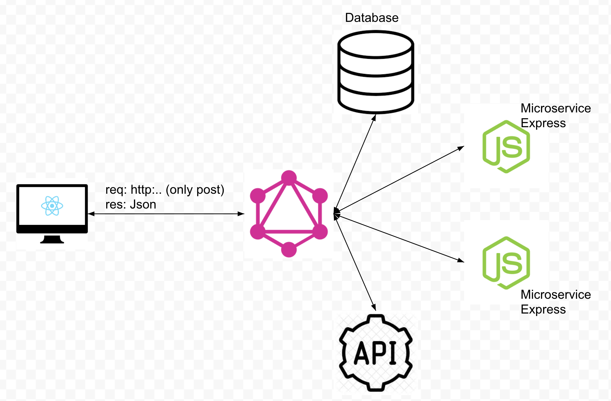

# JS-Microservice S



## Run user module
```
cd user
npm install 
npm run dev
```
<br>
The user module is running on port 8080.<br>
The data is static, currently we have only two users.
<br>

### Crud API
| Type   |      EndPoint                 |  Args   | Description        |
|--------|:------------------------------|:--------|:-------------------|
| GET    | http:localhost:8080/users     | -       | User list          |
| GET    | http:localhost:8080/user/:id  | id: Int | Get the user by id |
| POST   | http:localhost:8080/user      | -       | Create a new user  |
| PUT    | http:localhost:8080/user/:id  | id: Int | Update user by id  |
| DELETE | http:localhost:8080/user/:id  | id: Int | Delele user by id  |

### User Json Mapping
```
{
        id: Int,
        phone_number: String,
        email: String,
        created_at: String,
        region: String,
        country: String,
        gender: String,
        city: String,
        status: String,
        score: Float,
        name: String,
        tags: String,
        companies: [
            {
                id: Int,
                name: String,
                member_since: String
            }
        ]
    }
```


## Run graphQl module
```
cd graphql
npm install
npm run dev
```

<br>
The user module is running on port 8000.
<br>

### Crud API
| Type   |      EndPoint                 |  Args   | Description        |
|--------|:------------------------------|:--------|:-------------------|
| GET    | http:localhost:8000           | -       | [Playground graphql](https://www.apollographql.com/docs/apollo-server/testing/graphql-playground/) |

